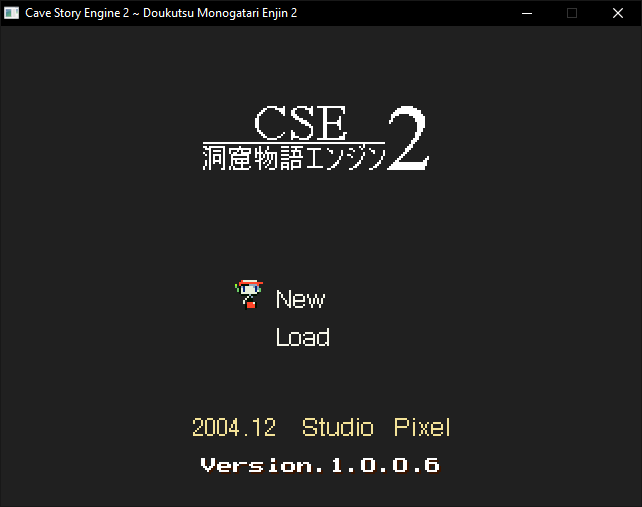

## Table of Contents

This repo has multiple branches:

Branch | Description
--------|--------
[accurate](https://www.github.com/Clownacy/Cave-Story-Engine-2/tree/accurate) | The main decompilation branch. The code intended to be as close to the original as possible, down to all the bugs and platform-dependencies.
[portable](https://www.github.com/Clownacy/Cave-Story-Engine-2/tree/portable) | This branch ports the engine to SDL2, and addresses numerous portability issues, allowing it to run on other platforms.
[enhanced](https://www.github.com/Clownacy/Cave-Story-Engine-2/tree/enhanced) | Based on the portable branch, this adds several enhancements to the engine, and makes it more accessible to modders.
[emscripten](https://www.github.com/Clownacy/Cave-Story-Engine-2/tree/emscripten) | Modifies the engine to build with Emscripten, [allowing it to run in web browsers](http://sonicresearch.org/clownacy/cave.html).
[wii](https://www.github.com/Clownacy/Cave-Story-Engine-2/tree/wii) | Ports the engine to the Nintendo Wii.

# Cave Story Engine 2 (Enhanced)

Cave Story Engine 2 is a decompilation of Cave Story.

This branch adds several enhancements including:
* PNG support
* Full alpha blending support
* Fixed text blending, utilising the aforementioned alpha support
* All resource files moved to the data folder
* [Booster's Lab](https://github.com/taedixon/boosters-lab) support (open 'data/mrmap.bin')
* 60FPS
* Widescreen
* Vastly-improved fullscreen
* Automatic vsync (only enabled on 60hz monitors)
* Smooth sprite movement, through the removal of the design choice that locks sprites to a 320x240 grid when drawn (can be re-enabled by disabling SMOOTH_SPRITE_MOVEMENT)
* Bugfixes enabled by default
* Pixtone sounds split to .pxt files
* Support for Ogg Vorbis, FLAC, .it, .xm, .mod, .s3m, and Pxtone audio formats for music and SFX
* Support for high-resolution sprites (see SPRITE_SCALE in CommonDefines.h)
* Extra TSC commands
  * <MS4



## Background

In 2007, a Linux port of Cave Story was made by Peter Mackay and Simon Parzer. Details about it can be found in [Peter's old blog](https://web.archive.org/web/20070911202919/http://aaiiee.wordpress.com:80/). This port received an update in 2011, including two shiny new executables. What Peter and Simon didn't realise was that they left huge amounts of debugging information in these executables, including the names of every C++ source file, and the variables and functions they contained.

This was a goldmine of information about not just the game's inner-workings, but its _source code._ This alone made a decompilation viable, but it wasn't the only help we'd get...

When Pixel made Cave Story, he compiled the original Windows EXE with no optimisations. This left the generated assembly code extremely verbose and easy to read. It also made the code very decompiler-friendly, since the assembly could be mapped directly back to the original C(++) code.

A combination of easy-to-decompile code and a near-complete symbol list made much of the decompilation process a copy/paste job, but not all of the game would need decompiling, as some of Cave Story's source code would actually see the light of day...

In early 2018, the Organya music engine was [released on GitHub](https://github.com/shbow/organya) by an old friend of Pixel's. On top of providing an insight into Pixel's coding style, this helped with figuring out one of the most complex parts of Cave Story's codebase.

It's because of these findings that a decompilation is possible: [the Mario 64 decompilation project](https://github.com/n64decomp/sm64) had a game that was built with no optimisations, [the Devilution project](https://github.com/diasurgical/devilution) was lucky enough to find a symbol list, so it's a miracle that we have both!

Many months of copypasting and tinkering later, here is the result.

## Dependencies

*Note: with CMake, if these are not found, they will be built locally*

* SDL2
* Freetype
* FLTK
* GLEW (if the OpenGL rendering backend is selected)
* libxmp-lite (only if AUDIO_TRACKER is enabled)

## Building

### CMake

This project primarily uses CMake, allowing it to be built with a range of compilers.

In this folder, create another folder called 'build', then switch to the command-line (Visual Studio users should open the [Developer Command Prompt](https://docs.microsoft.com/en-us/dotnet/framework/tools/developer-command-prompt-for-vs)) and `cd` into it. After that, generate the files for your build system with:

```
cmake .. -DCMAKE_BUILD_TYPE=Release
```

You can also add the following flags:

Name | Function
--------|--------
`-DJAPANESE=ON` | Enable the Japanese-language build (instead of the unofficial Aeon Genesis English translation)
`-DFIX_BUGS=ON` | Enabled by default - Fix various bugs in the game
`-DDEBUG_SAVE=ON` | Re-enable the ability to drag-and-drop save files onto the window
`-DRENDERER=OpenGL3` | Use the hardware-accelerated OpenGL 3.2 renderer
`-DRENDERER=SDLTexture` | Use the hardware-accelerated SDL2 Texture API renderer (default)
`-DRENDERER=Software` | Use the handwritten software renderer
`-DAUDIO_OGG=ON` | Enable support for Ogg Vorbis music/SFX
`-DAUDIO_FLAC=ON` | Enable support for FLAC music/SFX
`-DAUDIO_TRACKER=ON` | Enable support for .it, .xm, .mod, .s3m music/SFX
`-DAUDIO_PXTONE=ON` | Enable support for PxTone music/SFX (not to be confused with PixTone)
`-DSMOOTH_SPRITE_MOVEMENT=ON` | Enabled by default - Removes the grid that all sprites are locked to, allowing them to move smoothly at higher resolutions
`-DWARNINGS=ON` | Enable common compiler warnings (for gcc-compatible compilers and MSVC only)
`-DWARNINGS_ALL=ON` | Enable ALL compiler warnings (for clang and MSVC only)
`-DWARNINGS_FATAL=ON` | Stop compilation on any compiler warning (for gcc-compatible compilers and MSVC only)
`-DFORCE_LOCAL_LIBS=ON` | Compile the built-in versions of SDL2, FreeType, and FLTK instead of using the system-provided ones

Then compile CSE2 with this command:

```
cmake --build . --config Release
```

If you're a Visual Studio user, you can open the generated `CSE2.sln` file instead.

Once built, the executables and assets can be found in the newly-generated `game` folder.

### Makefile

*Note: this requires pkg-config*

Run 'make' in this folder, preferably with some of the following settings:

Name | Function
--------|--------
`RELEASE=1` | Compile a release build (optimised, stripped, etc.)
`STATIC=1` | Produce a statically-linked executable (good for Windows builds, so you don't need to bundle DLL files)
`JAPANESE=1` | Enable the Japanese-language build (instead of the unofficial Aeon Genesis English translation)
`FIX_BUGS=1` | Enabled by default - Fix various bugs in the game
`WINDOWS=1` | Build for Windows
`DEBUG_SAVE=1` | Re-enable the ability to drag-and-drop save files onto the window
`RENDERER=OpenGL3` | Use the hardware-accelerated OpenGL 3.2 renderer
`RENDERER=SDLTexture` | Use the hardware-accelerated SDL2 Texture API renderer (default)
`RENDERER=Software` | Use the hand-written software renderer
`AUDIO_OGG=1` | Enable support for Ogg Vorbis music/SFX
`AUDIO_FLAC=1` | Enable support for FLAC music/SFX
`AUDIO_TRACKER=1` | Enable support for .it, .xm, .mod, .s3m music/SFX
`AUDIO_PXTONE=1` | Enable support for PxTone music/SFX (not to be confused with PixTone)
`SMOOTH_SPRITE_MOVEMENT=1` | Enabled by default - Removes the grid that all sprites are locked to, allowing them to move smoothly at higher resolutions
`WARNINGS=1` | Enable common warnings
`WARNINGS_ALL=1` | Enable ALL warnings (clang/MSVC only)
`WARNINGS_FATAL=1` | Make all warnings errors

Once built, the executables and assets can be found in the newly-generated `game` folder.

## Licensing

Being a decompilation, the majority of the code in this project belongs to Daisuke "Pixel" Amaya - not us. We've yet to agree on a license for our own code.
